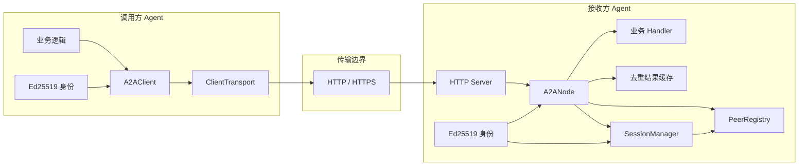
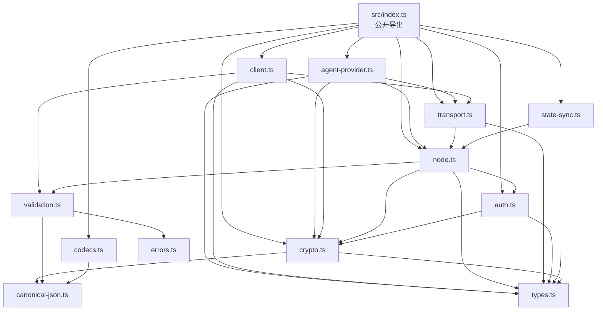
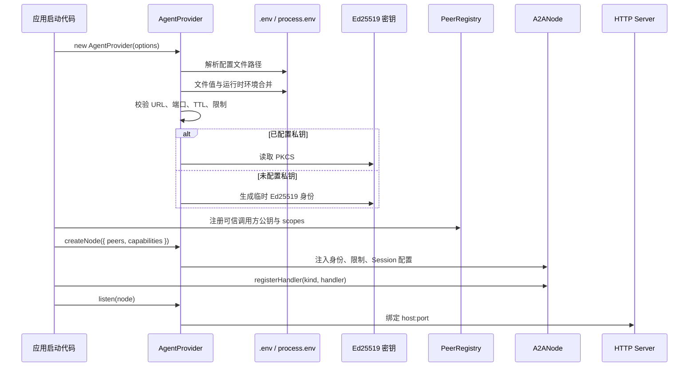
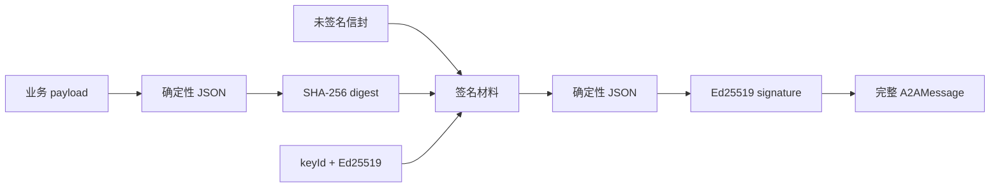
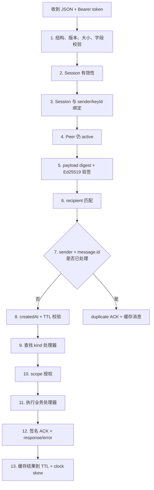
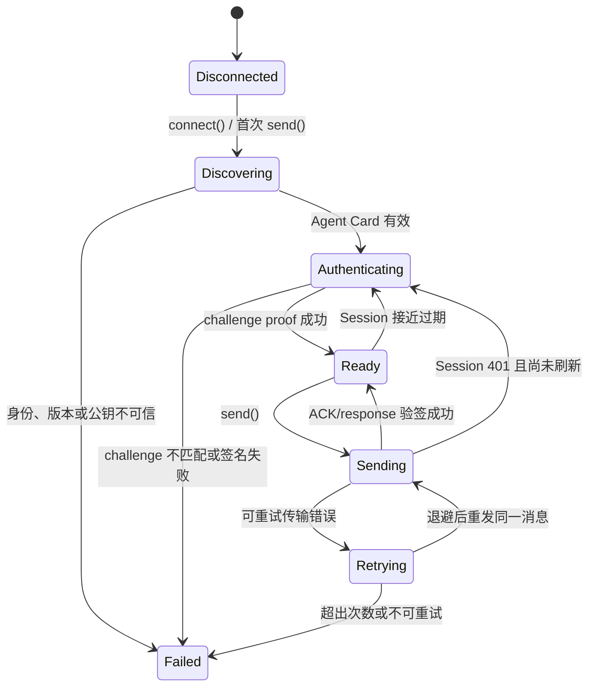
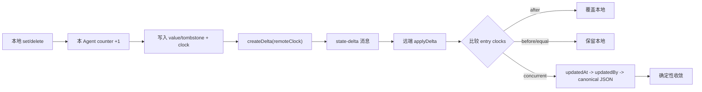

# 架构说明

## 1. 设计目标

A2A/1.0 把“一个 Agent 调用另一个 Agent”拆成独立层次：

1. 发现目标身份、地址、能力和限制。
2. 双方证明自己持有声明身份对应的私钥。
3. 服务端签发短期 Session，并只授予允许的 scopes。
4. 客户端构造不可篡改、可追踪、可去重的消息。
5. 服务端按固定顺序校验后执行处理器。
6. 服务端返回签名 ACK、业务响应或结构化错误。
7. 网络失败时安全重试同一消息。
8. 需要时交换加密载荷或增量状态。

协议的核心不是“发送一段 JSON”，而是把身份、权限、完整性、时效性和重试语义绑定在同一条消息上。

## 2. 系统全景



### 调用方职责

- 保存自己的 Ed25519 私钥。
- 固定或可信获取服务端公钥。
- 声明需要的 scopes。
- 创建消息语义和业务幂等键。
- 处理成功响应或 `A2AError`。

### 接收方职责

- 保存自己的 Ed25519 私钥。
- 维护可信调用方的 Agent ID、公钥和最大 scopes。
- 发布 Agent Card。
- 按消息 kind 注册处理器。
- 在处理业务前完成认证、验签、寻址、时效和授权检查。
- 对 ACK、response 和 error 统一签名。

## 3. 分层模型

| 层 | 输入 | 输出 | 主要模块 |
| --- | --- | --- | --- |
| 配置层 | `.env`、进程环境、构造参数 | 节点配置和服务端身份 | `agent-provider.ts` |
| 发现层 | HTTP GET | Agent Card | `transport.ts`、`node.ts` |
| 信任层 | Agent ID、key ID、公钥、scopes | 可信 Peer 记录 | `auth.ts` |
| 会话层 | challenge 请求和签名 proof | 短期 Bearer Session | `auth.ts`、`crypto.ts` |
| 消息层 | `MessageInput` | 已签名 `A2AMessage` | `types.ts`、`crypto.ts` |
| 边界校验层 | 未知 JSON | 结构合法消息 | `validation.ts` |
| 处理层 | 消息和 Session | ACK + 可选响应 | `node.ts` |
| 可靠性层 | 可重试错误 | 重发同一签名消息 | `client.ts`、`node.ts` |
| 状态层 | snapshot / delta | 收敛的 LWW Map | `state-sync.ts` |
| 编解码层 | 业务值 | JSON 线载荷 | `codecs.ts` |

每一层都保持单一职责。传输不决定授权，业务处理器不解析 Bearer token，状态同步不直接管理网络连接。

## 4. 模块依赖



## 5. 启动架构



配置与业务代码的边界：

- `.env` 定义“这个节点是谁、在哪里、接受多大消息、使用哪把服务端私钥”。
- `PeerRegistry` 定义“谁可以调用这个节点”。
- `capabilities` 定义“这个节点对外声称能做什么”。
- `registerHandler` 定义“收到某类消息后实际执行什么”。

Agent Card 的 capability 是发现元数据，不会自动创建处理器。处理器的 `requiredScopes` 才参与运行时授权。

## 6. 信任模型

### 6.1 两个方向的信任

```text
服务端信任客户端
  PeerRegistry[client agentId + client keyId]
  -> client public key
  -> granted scopes

客户端信任服务端
  expectedAgentId
  + trustedServerKeys[server keyId]
  -> server public key
```

服务端通过 Peer Registry 确认调用方。客户端通过 `expectedAgentId` 和 `trustedServerKeys` 确认服务端。

如果客户端不提供 `trustedServerKeys`，会使用 Agent Card 自带公钥。此时安全性依赖 Agent Card 的获取通道，例如可信 TLS、私有注册中心或受保护的配置分发。

### 6.2 三重绑定

服务端处理消息前同时检查：

```text
Session.agentId == message.sender
Session.keyId   == message.security.keyId
PeerRegistry(agentId, keyId) 仍处于 active
```

之后再用 Peer Registry 中的公钥验证消息签名。这防止：

- Agent A 使用自己的 Session 发送声称来自 Agent B 的消息。
- Session 由 key-1 建立，但消息改用 key-2 签名。
- 密钥撤销后继续使用尚未自然过期的 Session。

## 7. 消息安全模型

签名覆盖以下内容：

```text
protocol
id
kind
sender / recipient
createdAt / ttlMs
sequence
contentType / payloadDigest
conversationId / correlationId / causationId
idempotencyKey
requiredScopes
trace
extensions
security.keyId / security.algorithm
```

生成过程：



确定性 JSON 会：

- 递归排序对象键。
- 保持数组顺序。
- 把 `-0` 表示为 `0`。
- 拒绝 `undefined`、非有限数字和非普通 JSON 对象。

载荷摘要和完整信封签名是两项检查：

- 摘要用于明确绑定 payload。
- 完整签名保护整个信封，防止收件人、TTL、scope 或 trace 被修改。

## 8. 服务端接收管线

`A2ANode.receive()` 的顺序是安全语义的一部分：



重要结果：

- 未通过前置检查的消息不会进入处理器。
- 去重检查发生在新消息时效检查之前，因此去重窗口内的重发可获得缓存结果。
- 授权检查发生在处理器调用之前。
- 处理器抛出的异常会变为签名 `error` 消息和 `rejected` ACK。
- 验证、认证、寻址、路由等前置错误通过非 2xx HTTP 协议错误返回。

## 9. 客户端状态机



客户端缓存：

- 最近一次 Agent Card。
- 当前 Session Grant。
- 可信服务端公钥映射。
- 每个 conversation 的下一个 sequence。

这些状态都在进程内，客户端重启后会重新发现和认证。

## 10. 存储与生命周期

| 数据 | 默认位置 | 生命周期 | 多副本要求 |
| --- | --- | --- | --- |
| 服务端签名私钥 | 进程或 PEM 文件 | 节点身份周期 | KMS/HSM 或一致挂载 |
| Peer Registry | 单进程 Map | 进程周期 | 共享身份目录或配置分发 |
| Pending challenge | 单进程 Map | 默认 30 秒 | 共享 TTL 原子存储或认证粘性 |
| Session token | 单进程 Map | 默认 15 分钟 | 共享 TTL 存储或会话粘性 |
| 消息去重结果 | 单进程 Map | 消息 TTL + clock skew | 共享 inbox/result store |
| 客户端 Session | 客户端内存 | Session 到期 | 通常无需共享 |
| ReplicatedState | 单进程 Map | 进程周期 | 持久化 snapshot/delta 日志 |

参考实现故意保持存储接口简单，但这意味着直接水平扩展会破坏认证和去重语义。生产替换方案见 [生产部署](./deployment.md)。

## 11. 可靠性语义

### 11.1 当前保证

```text
网络发送：至少一次尝试
单节点去重窗口内：处理器效果一次
跨重启/跨副本/超出窗口：不保证效果一次
```

客户端重试时复用相同的：

- 消息 ID。
- `createdAt` 和 TTL。
- payload。
- 完整签名。

服务端用 `sender + message.id` 做去重键。第一次的 response/error 会随缓存保留，重试收到 `duplicate` ACK 和原消息集合。

### 11.2 业务幂等

`idempotencyKey` 被签名保护，但参考实现不把它作为运行时去重键。它用于业务层建立跨重启和跨服务的唯一约束，例如：

```sql
create unique index uq_agent_operation
on command_inbox(sender_agent_id, idempotency_key);
```

## 12. 状态同步架构

`ReplicatedState` 是按 key 的 Last-Writer-Wins Map，每条 entry 自带完整向量时钟。



删除使用 tombstone。若提前物理删除 tombstone，离线副本重新上线时可能恢复已删除值，因此清理前必须确认所有副本都观察到删除时钟。

## 13. 扩展点

### 自定义消息

使用 `x-*`：

```ts
node.registerHandler("x-plan-review", handler, {
  requiredScopes: ["plans:review"],
});
```

### 自定义载荷

实现 `PayloadCodec<T>` 并注册到 `CodecRegistry`。Codec 只负责业务值与 JSON 线载荷之间的转换，不会自动接入 `A2AClient.send()`；应用需要显式调用 `encode()` / `decode()`。

### 自定义传输

实现四个方法：

```ts
interface ClientTransport {
  discover(): Promise<AgentCard>;
  requestChallenge(request: ChallengeRequest): Promise<Challenge>;
  verifyChallenge(input: ChallengeVerification): Promise<SessionGrant>;
  send(message: A2AMessage, token: string): Promise<DeliveryBundle>;
}
```

传输可以是消息队列、Unix socket 或其他 RPC，但不能修改已签名字段。

### Agent Card 扩展

自定义元数据必须放在 `extensions` 中并使用 `x-` 前缀。扩展不能改变身份、寻址、TTL 或授权核心语义。

## 14. 已知边界

- HTTP Server 使用 Node.js 原生 `http`，TLS 需要反向代理或自定义 HTTPS 接入。
- challenge、Session、Peer Registry、去重和状态都在内存中。
- Agent Card 只发布当前服务端签名身份的一把 active 公钥。
- 载荷加密是显式工具，不会由 Client/Node 自动协商或自动解密。
- Agent Card 当前没有 X25519 加密公钥字段，加密公钥需要通过可信配置或扩展分发。
- `sequence` 用于观察会话顺序，不会阻塞或重排并发 HTTP 消息。
- `accepted` ACK 为异步队列扩展保留，当前同步处理管线返回 `completed`、`rejected` 或 `duplicate`。
- 状态同步提供最终一致，不提供共识、事务、锁或唯一性保证。
