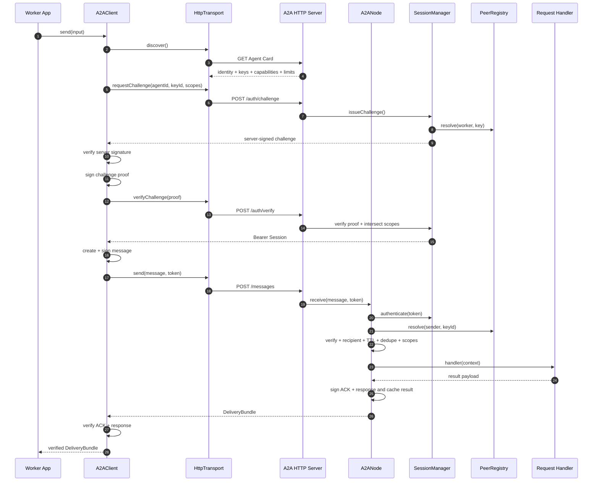
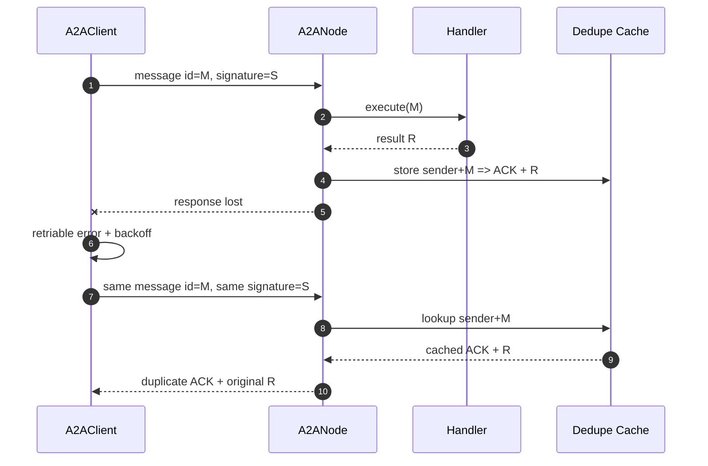
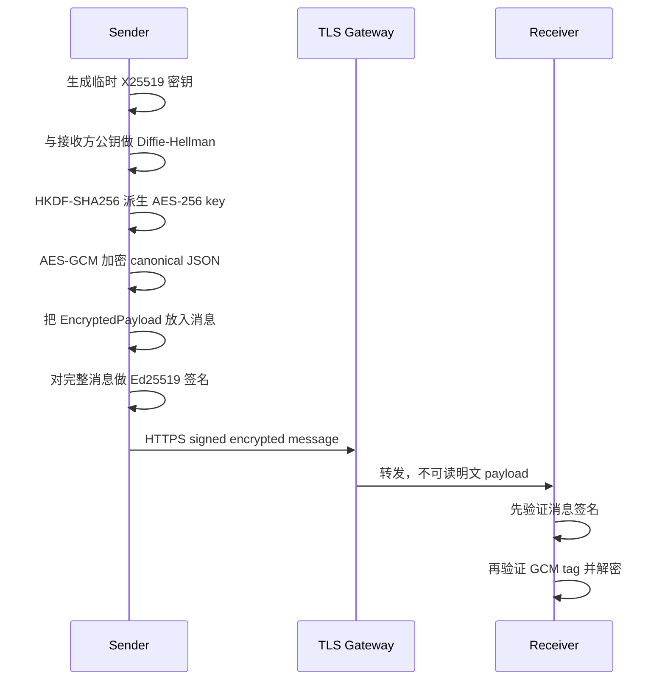
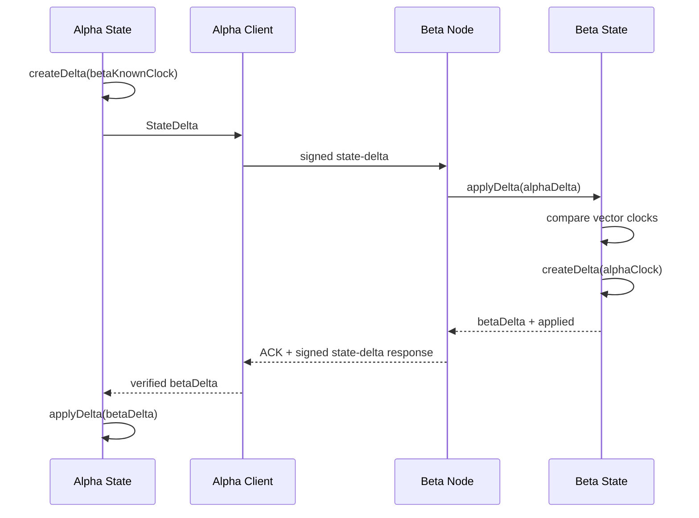

# 数据流详解

本文按数据实际经过的顺序描述 A2A/1.0。示例角色：

- 调用方：`agent://worker`
- 接收方：`agent://coordinator`
- 请求 scope：`tasks:execute`
- 消息类型：`request`

## 1. 总数据流



第一次 `send()` 包含发现和认证。Session 有效期间的后续 `send()` 只走消息发送部分。

## 2. 阶段 0：节点启动

### 输入

- `.env` 文件。
- 进程环境变量。
- `AgentProviderOptions`。
- 可信调用方公钥和 scopes。
- 能力描述和消息处理器。

### 处理

```text
配置路径解析
  -> 读取 dotenv
  -> runtime env 覆盖文件值
  -> 校验 endpoint / port / TTL / size
  -> 加载或生成 Ed25519 身份
  -> 创建 A2ANode
  -> 构建 Agent Card
  -> 注册 handlers
  -> 启动 HTTP Server
```

### 输出

- 一个绑定 host/port 的 HTTP Server。
- 一个包含身份、能力和限制的 Agent Card。
- 一个持有 Peer Registry、SessionManager 和去重缓存的 `A2ANode`。

### 数据去向

| 数据 | 去向 |
| --- | --- |
| 服务端私钥 | 仅留在 `SigningIdentity.privateKey` |
| 服务端公钥 | 进入 Agent Card |
| 调用方公钥 | 进入 `PeerRegistry` |
| scopes | 进入 Peer Registry 和 handler registration |
| 网络配置 | 进入 Agent Card 和 HTTP Server |

## 3. 阶段 1：发现

### HTTP 请求

```http
GET /.well-known/a2a-agent.json HTTP/1.1
Host: coordinator.example.com
Accept: application/json
```

### HTTP 响应

```json
{
  "agentId": "agent://coordinator",
  "name": "Coordinator",
  "protocolVersions": ["1.0"],
  "endpoint": "https://coordinator.example.com",
  "transports": ["https"],
  "contentTypes": ["application/json"],
  "authentication": {
    "scheme": "A2A-Challenge",
    "proofAlgorithm": "Ed25519",
    "sessionTokenLocation": "Authorization"
  },
  "publicKeys": [
    {
      "keyId": "coordinator-2026-q3",
      "algorithm": "Ed25519",
      "publicKeyPem": "-----BEGIN PUBLIC KEY-----\n...\n-----END PUBLIC KEY-----\n",
      "status": "active"
    }
  ],
  "capabilities": [
    {
      "name": "execute-task",
      "messageKinds": ["request"],
      "requiredScopes": ["tasks:execute"]
    }
  ],
  "limits": {
    "maxMessageBytes": 1048576,
    "maxTtlMs": 300000
  }
}
```

### 客户端验证

`A2AClient.connect()` 依次确认：

1. Agent Card 基本结构合法。
2. `agentId` 等于 `expectedAgentId`，如果已配置。
3. `protocolVersions` 包含 `1.0`。
4. 至少存在一把可接受的服务端公钥。

公钥来源优先级：

```text
trustedServerKeys 非空
  -> 只使用固定公钥

trustedServerKeys 为空
  -> 使用 Agent Card 中 status != revoked 的公钥
```

### 信任边界

Agent Card 是“声明”，不是天然可信的证明。生产客户端应同时验证 HTTPS 身份，并通过固定公钥、私有 PKI 或可信注册中心验证其中的 key。

## 4. 阶段 2：challenge 认证

### 4.1 客户端请求 challenge

```http
POST /a2a/v1/auth/challenge HTTP/1.1
Content-Type: application/json

{
  "agentId": "agent://worker",
  "keyId": "worker-2026-q3",
  "requestedScopes": ["tasks:execute"]
}
```

### 4.2 服务端创建 challenge

服务端：

1. 用 `agentId + keyId` 查询 Peer Registry。
2. 确认该 peer key 为 active。
3. 清理过期 challenge 和 Session。
4. 检查 pending challenge 数量，默认最多 10,000。
5. scopes 去重并排序。
6. 生成 UUID challenge ID 和 32 字节随机 challenge。
7. 设置过期时间。
8. 用服务端 Ed25519 私钥签名完整 proof material。
9. 把 challenge 保存到进程内 Map。

返回：

```json
{
  "challengeId": "019...",
  "challenge": "base64url-random",
  "agentId": "agent://worker",
  "audience": "agent://coordinator",
  "keyId": "worker-2026-q3",
  "serverKeyId": "coordinator-2026-q3",
  "requestedScopes": ["tasks:execute"],
  "expiresAt": "2026-09-07T10:00:30.000Z",
  "serverSignature": "base64url-ed25519-signature"
}
```

### 4.3 客户端验证服务端

客户端不直接签名返回值，而是先检查：

- `agentId` 和 `keyId` 与客户端身份一致。
- `audience` 与发现的服务端 Agent ID 一致。
- `requestedScopes` 与请求值排序后完全一致。
- challenge 未过期。
- `serverKeyId` 能在可信服务端公钥中找到。
- `serverSignature` 对确定性 proof material 有效。

这一步让客户端先验证服务端，防止把自己的挑战签名交给未知端点。

### 4.4 客户端提交 proof

客户端使用自己的 Ed25519 私钥，对与服务端完全相同的 proof material 签名：

```http
POST /a2a/v1/auth/verify HTTP/1.1
Content-Type: application/json

{
  "challengeId": "019...",
  "signature": "base64url-worker-signature"
}
```

### 4.5 服务端签发 Session

服务端先从 Map 删除 challenge，再执行验签。因此无论成功还是失败，同一 challenge 都不能再次使用。

```text
granted session scopes
  = requested scopes
  ∩ peer.grantedScopes
```

响应：

```json
{
  "token": "opaque-random-bearer-token",
  "tokenType": "Bearer",
  "agentId": "agent://worker",
  "scopes": ["tasks:execute"],
  "expiresAt": "2026-09-07T10:15:00.000Z"
}
```

Bearer token 是凭证，不能写入日志、URL、trace 或消息 payload。

## 5. 阶段 3：创建签名消息

应用提供：

```ts
{
  kind: "request",
  recipient: "agent://coordinator",
  payload: {
    task: "summarize"
  },
  conversationId: "conversation-42",
  idempotencyKey: "task-42"
}
```

`A2AClient` 补充：

- `protocol = "1.0"`
- 随机 UUID `id`
- `sender = identity.agentId`
- 当前 `createdAt`
- 默认 `ttlMs = 30000`
- 会话内递增 `sequence`
- 默认 `contentType = "application/json"`

然后执行：

```text
payload
  -> canonical JSON
  -> SHA-256
  -> base64url payloadDigest

unsigned envelope + keyId + algorithm + payloadDigest
  -> canonical JSON
  -> Ed25519 sign
  -> base64url signature
```

最终线消息：

```json
{
  "protocol": "1.0",
  "id": "31f39781-70dd-4330-b95f-2dc82a1bb4d4",
  "kind": "request",
  "sender": "agent://worker",
  "recipient": "agent://coordinator",
  "createdAt": "2026-09-07T10:00:00.000Z",
  "ttlMs": 30000,
  "sequence": 0,
  "contentType": "application/json",
  "payload": {
    "task": "summarize"
  },
  "conversationId": "conversation-42",
  "idempotencyKey": "task-42",
  "security": {
    "keyId": "worker-2026-q3",
    "algorithm": "Ed25519",
    "payloadDigest": "base64url-sha256",
    "signature": "base64url-ed25519-signature"
  }
}
```

## 6. 阶段 4：发送与服务端接收

### HTTP 请求

```http
POST /a2a/v1/messages HTTP/1.1
Authorization: Bearer <opaque-token>
Content-Type: application/json
Accept: application/json

{ ...signed A2AMessage... }
```

### 服务端顺序

| 顺序 | 检查 | 失败结果 | 是否进入 handler |
| ---: | --- | --- | --- |
| 1 | HTTP Content-Type 和请求体大小 | 415 / 413 | 否 |
| 2 | JSON 解析 | `INVALID_MESSAGE` 400 | 否 |
| 3 | 协议结构、版本、字段、消息大小 | 400 / 413 | 否 |
| 4 | Bearer Session 存在且未过期 | 401 | 否 |
| 5 | Session agent/key 与消息一致 | 401 | 否 |
| 6 | Peer key 仍为 active | 401 | 否 |
| 7 | payload digest 和消息签名 | 401 | 否 |
| 8 | recipient 是本节点或 `*` | 400 | 否 |
| 9 | `sender + message.id` 去重 | duplicate ACK | 否 |
| 10 | createdAt 不超前且未过 TTL | 400 / 408 | 否 |
| 11 | kind 有处理器 | 404 | 否 |
| 12 | Session scopes 足够 | 403 | 否 |
| 13 | 调用 handler | 业务结果 | 是 |

`requiredScopes` 的最终集合：

```text
handler registration requiredScopes
  ∪ message.requiredScopes
```

客户端不能通过省略 `message.requiredScopes` 绕过处理器声明的 scope。

## 7. 阶段 5：成功响应

处理器返回：

```ts
return {
  payload: {
    summary: "..."
  }
};
```

服务端创建两个签名消息：

### ACK

```json
{
  "kind": "ack",
  "sender": "agent://coordinator",
  "recipient": "agent://worker",
  "conversationId": "conversation-42",
  "correlationId": "<request-message-id>",
  "causationId": "<request-message-id>",
  "payload": {
    "messageId": "<request-message-id>",
    "status": "completed"
  },
  "security": {
    "keyId": "coordinator-2026-q3",
    "algorithm": "Ed25519",
    "payloadDigest": "...",
    "signature": "..."
  }
}
```

### Response

```json
{
  "kind": "response",
  "sender": "agent://coordinator",
  "recipient": "agent://worker",
  "conversationId": "conversation-42",
  "correlationId": "<request-message-id>",
  "causationId": "<request-message-id>",
  "payload": {
    "summary": "..."
  },
  "security": {
    "keyId": "coordinator-2026-q3",
    "algorithm": "Ed25519",
    "payloadDigest": "...",
    "signature": "..."
  }
}
```

两者包装为：

```json
{
  "ack": { "...": "signed ack" },
  "messages": [
    { "...": "signed response" }
  ]
}
```

如果 handler 返回 `void`，仍有 completed ACK，但 `messages` 是空数组。

## 8. 阶段 6：客户端验证响应

客户端把 ACK 和 `messages[]` 逐条验证：

1. 消息结构与远端 Agent Card 限制相符。
2. `sender` 等于远端 Agent ID。
3. `recipient` 等于客户端 Agent ID。
4. `correlationId` 等于原请求消息 ID。
5. `security.keyId` 能在可信服务端公钥中找到。
6. payload digest 和 Ed25519 签名有效。
7. 第一条 ACK 的 kind 是 `ack`。
8. ACK payload 中 `messageId` 等于原请求消息 ID。

只有全部验证通过，`send()` 才把 `DeliveryBundle` 交给业务代码。

## 9. 错误数据流

错误分两类，它们的传输方式不同。

### 9.1 前置协议错误

发生位置：

- JSON 或字段非法。
- Session 无效。
- 身份不匹配。
- 签名错误。
- 收件人错误。
- 消息过期。
- 没有处理器。
- scope 不足。

返回非 2xx HTTP：

```json
{
  "error": {
    "code": "AUTHORIZATION_DENIED",
    "message": "The authenticated agent lacks required scopes",
    "retriable": false,
    "details": {
      "missingScopes": ["tasks:execute"]
    }
  }
}
```

这类错误发生在业务处理器成功开始之前，不返回协议内 ACK。

### 9.2 处理器错误

处理器抛出：

```ts
throw new A2AError(
  ErrorCode.HandlerFailed,
  "Task input is not supported",
  {
    status: 422,
    retriable: false,
    details: {
      field: "task"
    }
  },
);
```

HTTP 仍返回 200，但 `DeliveryBundle` 包含：

```text
signed ACK(status = rejected)
+ signed error message
```

客户端验证签名后，把它转换回 `A2AError` 抛给调用代码。这样可以区分：

- HTTP/网络层未成功交付。
- 服务端已认证、已执行处理器，但业务拒绝。

未知异常会被 `asA2AError()` 转成：

```json
{
  "code": "INTERNAL_ERROR",
  "message": "An internal error occurred",
  "retriable": true
}
```

内部异常细节不会发送给调用方。

## 10. 重试和去重数据流

### 场景：服务端已执行，但响应在网络中丢失



重试策略默认值：

```json
{
  "maxAttempts": 4,
  "initialDelayMs": 100,
  "maxDelayMs": 2000,
  "backoffFactor": 2,
  "jitterRatio": 0.2
}
```

无抖动时尝试前的基础延迟近似为：

```text
第 1 次失败后：100 ms
第 2 次失败后：200 ms
第 3 次失败后：400 ms
```

客户端只重试 `A2AError.retriable === true` 的错误。HTTP `429` 和 `5xx` 在没有明确错误标记时默认为可重试。处理器拒绝转成的 422 不重试。

### Session 401

如果发送时收到 401，客户端会：

1. 清空 Session。
2. 重新执行 challenge 认证。
3. 再次发送同一条已签名消息。
4. 每次 `sendSigned()` 最多执行一次这种强制刷新。

Session 更新不要求重新生成业务消息，因为消息身份仍由 Ed25519 签名确定。

### 去重窗口

缓存到期时间：

```text
message.createdAt + message.ttlMs + allowedClockSkewMs
```

超过该时间或进程重启后，缓存不再提供效果一次语义。业务层应使用 `idempotencyKey` 和持久唯一约束。

## 11. 端到端载荷加密流

TLS 保护连接。可选载荷加密进一步让中间网关无法读取 payload。



示例：

```ts
const encrypted = encryptJson(
  { secret: "confidential" },
  receiverEncryptionPublicKey,
  "receiver-enc-2026-q3",
  "task-42",
);

const delivery = await client.send({
  kind: "request",
  recipient: "agent://coordinator",
  idempotencyKey: "task-42",
  payload: encrypted,
});
```

接收方：

```ts
const plaintext = decryptJson(
  message.payload as EncryptedPayload,
  receiverEncryptionIdentity,
  message.idempotencyKey,
);
```

注意：

- Associated data 必须两端完全一致。
- 加密公钥当前不在标准 Agent Card 字段中，需要可信配置或 `x-*` 扩展分发。
- 加密工具不会自动接入 handler，应用负责识别和解密。
- 必须先验消息签名，再解密 payload。
- TLS 仍然必需，因为 Bearer token、路由元数据和流量特征不受 payload 加密保护。

## 12. 状态增量同步流

假设 Alpha 和 Beta 都维护 namespace `workflow`。

### 12.1 Alpha 本地写入

```ts
alpha.set("step", 2);
```

内部变化：

```json
{
  "key": "step",
  "value": 2,
  "clock": {
    "agent://alpha": 1
  },
  "updatedAt": "2026-09-07T10:00:00.000Z",
  "updatedBy": "agent://alpha"
}
```

### 12.2 Alpha 根据 Beta 游标创建 delta

```ts
const delta = alpha.createDelta(betaKnownClock);
```

```json
{
  "namespace": "workflow",
  "baseClock": {
    "agent://beta": 3
  },
  "clock": {
    "agent://alpha": 1,
    "agent://beta": 3
  },
  "changes": [
    {
      "key": "step",
      "value": 2,
      "clock": {
        "agent://alpha": 1,
        "agent://beta": 3
      },
      "updatedAt": "2026-09-07T10:00:00.000Z",
      "updatedBy": "agent://alpha"
    }
  ]
}
```

### 12.3 通过 A2A 发送

```ts
const delivery = await alphaClient.send({
  kind: "state-delta",
  recipient: "agent://beta",
  payload: delta,
  requiredScopes: ["state:sync"],
});
```

Beta 的 `registerStateSyncHandlers()`：

1. 校验 namespace、clock 和 entries。
2. `applyDelta(delta)`。
3. 根据 `delta.clock` 创建 Beta 侧缺失内容。
4. 在 response 中返回反向 delta 和 `applied` 数量。



一次往返可以完成常见双向增量同步，但调用方必须显式把返回的 delta 应用到本地状态。

### 12.4 并发冲突

对同一个 key：

```text
incoming clock after local
  -> incoming 覆盖 local

incoming clock before/equal local
  -> 保留 local

clocks concurrent
  -> updatedAt 较大者胜
  -> 若相同，updatedBy 字典序较大者胜
  -> 若仍相同，canonical entry JSON 较大者胜
```

最后两级规则不是业务优先级，而是保证各副本做出相同决定。

### 12.5 删除流

`delete(key)` 不直接移除 entry，而是写入：

```json
{
  "key": "temporaryLease",
  "value": null,
  "tombstone": true,
  "clock": {
    "agent://alpha": 7
  },
  "updatedAt": "...",
  "updatedBy": "agent://alpha"
}
```

tombstone 必须传播到所有副本。只有建立全局确认或版本水位后才能物理清理。

## 13. 关联和追踪数据

四个字段承担不同职责：

| 字段 | 作用 | 示例 |
| --- | --- | --- |
| `conversationId` | 把多轮业务消息放进同一会话 | `workflow-42` |
| `correlationId` | 指向当前响应所对应的请求 | 原 request message ID |
| `causationId` | 指向直接触发当前消息的消息 | 触发该 event 的 command ID |
| `trace` | 跨服务技术追踪上下文 | W3C trace/span 风格 |

`A2ANode` 创建 ACK 和 response 时自动设置：

```text
conversationId = request.conversationId ?? request.id
correlationId  = request.id
causationId    = request.id
```

日志建议至少记录：

```text
message.id
message.kind
message.sender
message.recipient
conversationId
correlationId
trace.traceId
ack.status
error.code
attempt
latencyMs
```

不要记录：

```text
Authorization Bearer token
私钥
challenge proof
敏感明文 payload
```

## 14. 数据分类和保护

| 数据 | 是否上网 | 是否签名覆盖 | 是否应记录 | 建议保护 |
| --- | --- | --- | --- | --- |
| Agent Card | 是 | challenge 后间接验证 | 可记录摘要 | HTTPS + 固定身份 |
| 服务端私钥 | 否 | 不适用 | 绝不 | KMS/HSM/Secret |
| 客户端私钥 | 否 | 不适用 | 绝不 | KMS/HSM/Secret |
| challenge | 是 | 服务端签名 | 仅 ID/过期时间 | 短 TTL、一次性 |
| challenge proof | 是 | 客户端签名 | 不记录 | TLS、一次性 |
| Bearer token | 请求头 | 不在消息签名中 | 绝不 | TLS、短 TTL |
| 消息信封 | 是 | 是 | 元数据可记录 | TLS + Ed25519 |
| 明文 payload | 是 | 是 | 按敏感级别 | TLS，可选 E2EE |
| 加密 payload | 是 | 是 | 可记录大小/算法 | X25519 + AES-GCM |
| 去重结果 | 服务端内部 | 内容本身已签名 | 可记录键摘要 | TTL + 共享存储 |
| 状态 delta | 是 | 是 | 按敏感级别 | scope + 可选 E2EE |

## 15. 关键不变量

实现或扩展协议时必须保持：

1. 业务处理器只能在认证、验签、寻址、时效和授权全部通过后执行。
2. 重试必须复用同一个已签名消息和消息 ID。
3. ACK、response 和 error 必须由接收方签名并关联原消息。
4. 传输适配器不能修改已签名字段。
5. Bearer token 只能通过安全传输发送，不进入 URL 或日志。
6. 撤销 Peer key 后，已有 Session 也必须失效。
7. 状态同步 tombstone 在全局可确认前不能单独清理。
8. `idempotencyKey` 必须由业务持久层执行跨进程唯一约束。
