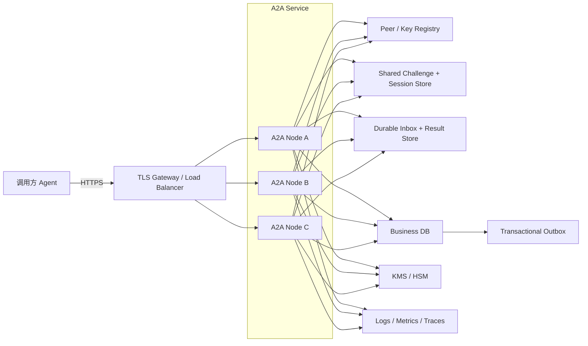
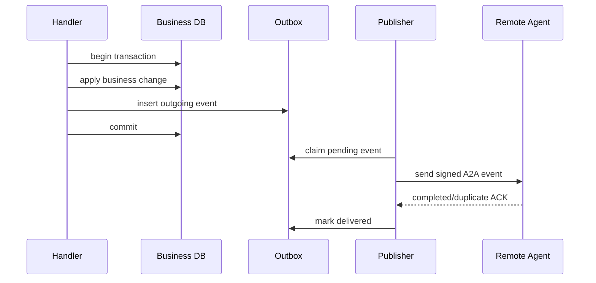

# 生产部署

参考实现可以直接用于本地、测试和单实例受控环境。生产部署必须补齐 TLS、持久身份、共享状态、限流和可观测性。

## 1. 先明确当前边界

下列数据默认保存在单个 Node.js 进程内：

- `PeerRegistry` 的可信调用方记录。
- 待验证 challenge。
- Bearer Session。
- `sender + message.id` 去重结果。
- `ReplicatedState` 数据。
- 客户端当前 Session 和 sequence。

因此直接把同一服务扩容到多个无状态副本会产生：

- 副本 A 签发的 challenge 可能被发到副本 B 验证，随后失败。
- 副本 A 签发的 Session 在副本 B 不存在。
- 同一消息落到不同副本时可能重复执行 handler。
- 各副本的 `ReplicatedState` 彼此不一致。

## 2. 部署成熟度

| 级别 | 拓扑 | 适用范围 | 主要限制 |
| --- | --- | --- | --- |
| 开发 | 单进程、临时密钥、HTTP | 本地验证 | 重启后身份变化 |
| 单实例生产 | 单副本、持久密钥、TLS 代理 | 低流量内部服务 | 实例故障会丢 Session 和去重缓存 |
| 粘性多副本 | 多副本、负载均衡会话粘性 | 过渡方案 | 故障切换仍破坏 Session/去重 |
| 完整多副本 | 多副本、共享认证/去重、持久 inbox/outbox | 高可用生产 | 需要扩展参考实现的存储接口 |

会话粘性只能减少跨副本错误，不等于高可用语义。

## 3. 推荐生产拓扑



## 4. TLS 和反向代理

应用本身使用 Node.js `http.Server`。推荐：

```text
Internet / cluster network
  -> TLS 1.3 gateway
  -> request size + rate + timeout policies
  -> 127.0.0.1:4310 A2A process
```

配置：

```dotenv
A2A_ENDPOINT=https://agents.example.com
A2A_LISTEN_HOST=127.0.0.1
A2A_LISTEN_PORT=4310
A2A_TRANSPORTS=https
```

网关必须：

- 保留 `Authorization`、`Content-Type` 和请求体原始 JSON 语义。
- 不修改消息体字段。
- 限制请求体大小，且限制不高于应用允许范围。
- 对 discovery 与消息端点使用不同缓存策略。
- 不缓存 challenge、verify 或 messages 响应。
- 不记录 Authorization header。
- 为消息接口设置高于应用典型 handler 时间、但低于上游总超时的限制。

服务端响应已带：

```text
Cache-Control: no-store
A2A-Version: 1.0
```

Agent Card 例外，默认：

```text
Cache-Control: public, max-age=300
```

密钥紧急撤销时需要主动清理网关和客户端发现缓存。

## 5. 持久身份

### 最低要求

- 每个逻辑 Agent ID 使用稳定 Ed25519 密钥。
- 私钥权限最小化。
- key ID 有明确版本。
- 公钥通过可信渠道分发。
- 有轮换、撤销和审计记录。

PEM 文件方式：

```dotenv
A2A_SIGNING_KEY_ID=coordinator-2026-q3
A2A_SIGNING_PRIVATE_KEY_FILE=/run/secrets/a2a-signing.pem
```

更高安全级别应使用 KMS/HSM。当前 `SigningIdentity` 使用 Node.js `KeyObject`，如果 KMS 不允许导出私钥，需要把签名操作抽象成外部 signer，而不是把 KMS 私钥导出到进程。

## 6. 共享 challenge 和 Session

共享存储必须支持：

### Challenge

- 以 `challengeId` 为键写入。
- 原子“读取并删除”，确保一次性消费。
- TTL 自动过期。
- 全局 pending 数量或按 Agent 限流。

### Session

- 以随机 Bearer token 或其安全哈希为键。
- 保存 `agentId`、`keyId`、scopes、expiresAt。
- TTL 自动过期。
- 每次认证时重新确认 peer key 未撤销。
- 支持按 peer/key 主动撤销。

推荐在存储中保存 token 的密码学哈希，而不是明文 token。收到请求后对 token 做哈希查询。

## 7. 持久 inbox、去重和结果缓存

对于有副作用的 handler，数据库事务应包含：

1. 插入 inbox 记录，唯一键为 `sender_agent_id + message_id`。
2. 使用 `sender_agent_id + idempotency_key` 建立可选业务唯一约束。
3. 执行业务状态变更。
4. 保存规范化业务结果或错误。
5. 标记 inbox 完成。
6. 提交事务。

示意表：

```sql
create table a2a_inbox (
  sender_agent_id text not null,
  message_id text not null,
  idempotency_key text,
  status text not null,
  result_json jsonb,
  expires_at timestamptz not null,
  created_at timestamptz not null default now(),
  primary key (sender_agent_id, message_id)
);

create unique index uq_a2a_business_operation
on a2a_inbox (sender_agent_id, idempotency_key)
where idempotency_key is not null;
```

并发收到相同消息时：

```text
第一个事务插入成功 -> 执行业务
第二个事务唯一键冲突 -> 读取第一个事务结果
```

只在内存 Map 上先检查再执行业务，会在多副本并发下发生竞态。

## 8. Transactional Outbox

如果 handler 修改数据库后还要发布事件，不要在数据库提交后直接“尽力发送”：



业务变更和 outbox 写入必须位于同一数据库事务。Publisher 可以重试同一条已签名消息。

## 9. Peer Registry

生产 Peer Registry 应来自：

- 受版本控制并签名的配置。
- 私有身份注册中心。
- 数据库加管理审批。
- PKI 映射服务。

每条记录至少包含：

```text
agentId
keyId
publicKey
status
grantedScopes
validFrom / validUntil
owner
audit metadata
```

变更流程：

- 新增 key 时先分发再启用。
- scope 变更遵循最小权限。
- 撤销必须快速传播到所有副本。
- 认证和每条消息处理都要观察最新撤销状态。

当前内存 `PeerRegistry.revoke()` 已保证本进程内现有 Session 立即失效，因为每次 `authenticate()` 都会再次 resolve peer。

## 10. 限流和容量

至少设置以下维度：

| 位置 | 限制维度 | 目的 |
| --- | --- | --- |
| 网关 | IP、Agent ID、路径 | 抵御连接和请求洪泛 |
| challenge | Agent ID、key ID、全局 pending | 防止认证状态耗尽 |
| Session | Agent ID、全局 active | 防止 Session 存储耗尽 |
| messages | Agent ID、kind、scope | 保护业务 handler |
| payload | HTTP bytes、协议 bytes、解密后 bytes | 防止内存放大 |
| state sync | namespace、entries、delta bytes | 防止大规模状态注入 |
| handler | 并发、队列深度、执行时长 | 防止资源饱和 |

参考实现的 `SessionManager` 默认最多保存：

```text
pending challenges: 10,000
active sessions:    10,000
```

这些上限当前通过 `SessionManagerOptions` 配置，不在 `.env` 中暴露。`AgentProvider` 创建节点时只传入 challenge TTL 和 Session TTL；如需调整容量，应直接构造 `A2ANode` 或扩展 Provider 配置。

## 11. 超时预算

从外到内设置递减或明确协调的超时：

```text
调用方业务总超时
  > A2A 重试总预算
  > 单次 HttpTransport requestTimeoutMs
  >= 网关 upstream timeout
  >= HTTP Server requestTimeoutMs 或 handler SLA
```

还要保证消息 TTL 覆盖允许的重试时间。消息过期后不能只更换时间戳并保留旧签名，应创建并签名新消息；是否允许再次执行业务由 `idempotencyKey` 判断。

## 12. 可观测性

### 日志字段

```text
timestamp
service / instance
messageId
idempotencyKey（可散列）
conversationId
correlationId
senderAgentId
recipientAgentId
kind
scope decision
ack status
error code
attempt
latencyMs
traceId / spanId
```

### 指标

```text
a2a_requests_total{route,status}
a2a_messages_total{kind,ack_status}
a2a_auth_challenges_total{result}
a2a_sessions_active
a2a_handler_duration_seconds{kind}
a2a_retry_total{reason}
a2a_duplicate_total{sender}
a2a_signature_failures_total{sender,key_id}
a2a_authorization_denied_total{scope}
a2a_message_bytes
a2a_state_delta_entries
a2a_inbox_pending
a2a_outbox_pending
```

### Trace

把消息 `trace.traceId` 和 `trace.spanId` 映射到本地 OpenTelemetry span。接收端应创建 server span，handler 创建 child span。不要盲目信任外部 trace 字段作为权限或租户标识。

## 13. 健康检查

当前项目没有独立 `/healthz` 或 `/readyz` 路由。

可选策略：

- 进程 liveness：由进程管理器确认 Node.js 进程存活。
- 协议 readiness：访问 `GET /.well-known/a2a-agent.json` 并验证 200。
- 完整 readiness：在外围应用增加独立端点，检查共享存储、密钥提供方和业务依赖。

不要通过 challenge 端点做高频健康检查，它会创建服务端状态。

## 14. 状态同步持久化

`ReplicatedState` 默认内存存储。生产需要至少持久化：

- namespace 当前 vector clock。
- 每个 key 的最新 entry。
- tombstone。
- snapshot 版本。
- 已知远端同步水位。

恢复流程：

```text
加载最新 snapshot
  -> 回放 snapshot 之后的 delta 日志
  -> 对远端发送本地 clock
  -> 拉取缺失 delta
  -> 重新达到收敛
```

不应把 `ReplicatedState` 用于：

- 余额。
- 库存扣减。
- 分布式锁。
- 唯一任务认领。
- 需要线性一致性的配置。

这些场景应使用事务数据库或共识系统。

## 15. 发布前检查

### 身份和网络

- [ ] `A2A_AGENT_ID` 稳定且全局唯一。
- [ ] 使用持久 Ed25519 私钥，不是启动时临时生成。
- [ ] `A2A_SIGNING_KEY_ID` 有版本并已登记。
- [ ] `A2A_ENDPOINT` 是调用方真实可达的 HTTPS 地址。
- [ ] 网关不记录 Authorization header。
- [ ] Agent Card 身份和公钥可被客户端可信验证。

### 授权

- [ ] 所有调用方都在受控 Peer Registry 中。
- [ ] 每个 handler 声明最小 required scopes。
- [ ] 没有无必要的 `grantedScopes: ["*"]`。
- [ ] 密钥和 scope 撤销能快速传播。

### 可靠性

- [ ] 高价值 handler 使用持久 inbox。
- [ ] 业务 `idempotencyKey` 有数据库唯一约束。
- [ ] 需要向外发送时使用 transactional outbox。
- [ ] 重试预算小于消息 TTL。
- [ ] 多副本共享 challenge、Session 和去重记录。

### 资源控制

- [ ] 网关和应用都限制消息大小。
- [ ] challenge、Session、消息和 handler 都有限流。
- [ ] handler 有并发和执行时间限制。
- [ ] 状态 delta 有 namespace、entry 数和字节限制。

### 运维

- [ ] 节点同步 NTP。
- [ ] 指标覆盖认证失败、验签失败、拒绝、重试和重复消息。
- [ ] 日志不含 token、私钥或明文敏感 payload。
- [ ] 有密钥轮换与紧急撤销演练。
- [ ] 有 Session、inbox、outbox 和状态存储的备份/恢复策略。
